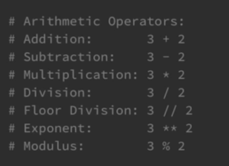

# Python Basics

Text

## Text


selecting part of a string(sub strings)

```python
message = "Hello World"
print(message[0:5])
```

This selects the first 5 characters of the string to be printed to the console

first num is the starting point is inclusive, howver the second number is exclusive and the ending point

assume first is always 0 unless otherwise stated

```python
message = "Hello World"
print(message[6:])
```

this starts from the 6 index and everything after that


A method is a function that belongs to an object, but are in essence the same thing


```python
message = "Hello World"
print(message[6:])
print(message.upper())
print(message.lower())
print(message.count("0")) # the number of times a letter appears
print(message.find("H")) #Finds a particular character in a string 
print(message.replace('world','universe') ## basically replaces one word in s string with another
```


```python
# outputs all the different methods and attributes that we have access with that variable
print(dir(message)) 
```

```python
print(help(str))
```

this shows the meaning of every single method available in the string class


## Integers and floats

<figure><figcaption></figcaption></figure>

```python
num = -1.66532
print(abs(num)) # modulus function
print(round(num)) # round the integer value
```

<figure><figcaption></figcaption></figure>

## Lists, Tuples, and Sets


```python
courses = ["science", "maths", "Physics", "Further maths"]
print(courses)
print(len(courses))
print(courses[0])
print(courses[:2])
```

### Modifying lists

```python
courses.append("Art")
# add an item to the end of a list
courses.insert(2,"Biology")
#adds an item at a specif index
courses2 = ["edu", "Stuff"]
courses.extend(courses2)
# Use to join two lists
```

```python
courses.remove("maths")
# use to remove item from list
courses.pop()
# this will remove the last value and return it, so can be assigned to variable
```

### Sorting lists

```python
courses.reverse()
#reverses the order
courses.sort()
#sort list in ascending order
courses.sort(reverse=True)
#for decending order
sorted(courses)
# This will not automatically sort the list stored but return a copy of the list sorted
```

```python
min(courses)
max(courses)
sum([1,2,3,2,2,3,3,])
```

```python
courses.index("maths")
#used to finding the exact value the specific item in list is held

print("art" in courses)
# for returning true or false in list or not

for indec,item in enumerate(courses):
    print(indec, item)
 print('.' .join(courses)) # gives the list seperated by the full stop
```

## Tuples

Tuples and immutable, so cannot be changed, more or less same thing

```python
names = ("shourya", "1")
```

Sets

cannot be duplicates, via curly brackets, unordered


```python
set1 = {2,3,3,2,2,3,3,3,2,3,34}
```

this will remove duplicates

we can use .intersection method to see common items between 2 sets

and difference to find the items not in the other set and use the union method to print items from both sets

<figure><figcaption></figcaption></figure>
